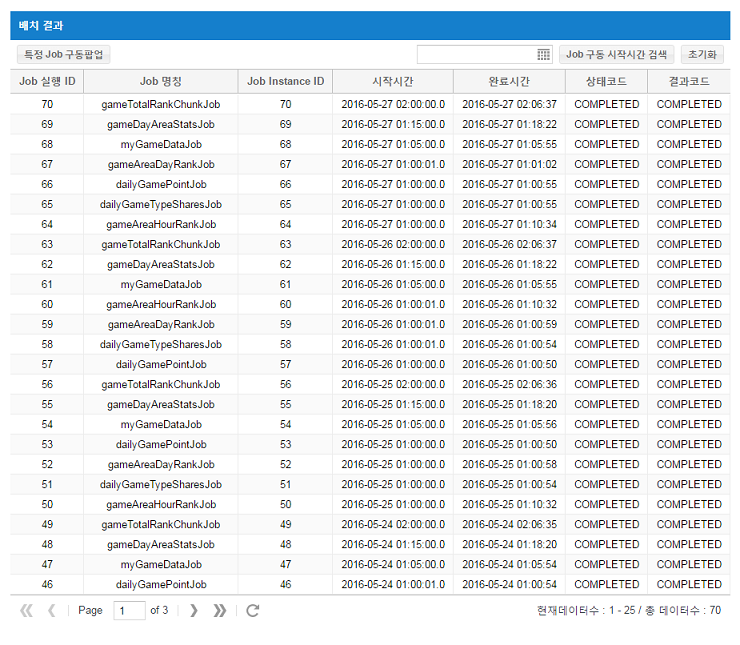
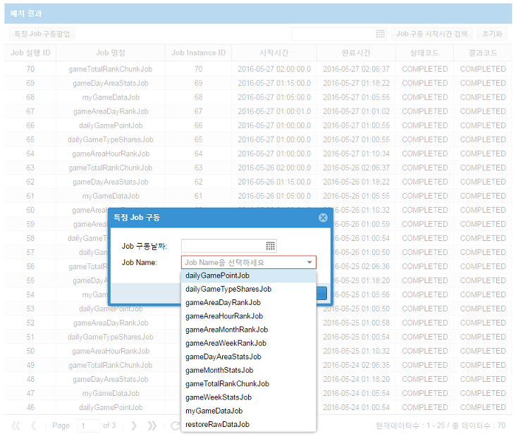
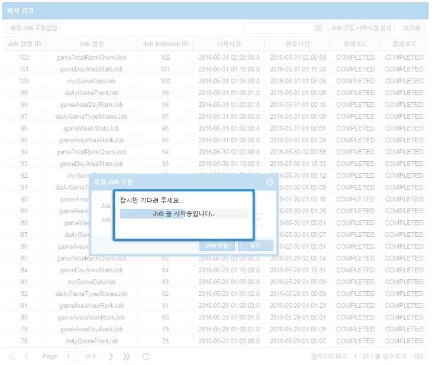
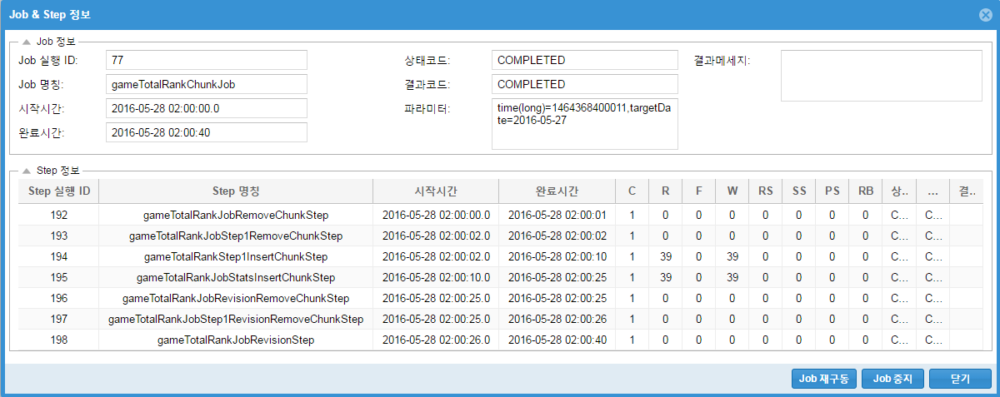

# Bamons

Bamons (Batch Monitoring System)는 Spring Batch 프레임워크를 이용한 배치 프로세스를 모니터링하기 위한 오픈소스 프로젝트이다.
   

##### [Job 메인리스트 화면]

##### [특정 Job 선택 화면]

##### [특정 Job 구동 화면]

##### [Job & Step 상세 내역 화면]

  
#### 라이센스 정책
* 자유롭게 소스를 사용하셔도 되지만, 상업적인 용도로는 사용이 불가능합니다.

 
개발 환경
* JDK 7 이상
* Sencha Cmd v6.1.2.15
* ext-6.0.1 GPL
* Spring 4.2.0.RELEASE
* Spring Batch 3.0.6.RELEASE
* Spring Integration 4.2.5.RELEASE

 
Bamons 기능
* Job 리스트 및 날짜별 검색
* 특정 Job 구동 (설정 Job 리스트 자동 로딩)
* Job & Step 상세 내역 보기, Job 재구동 및 중지

 
#### Bamons Goal
* Spring Integration 연동 추가
* Batch 연관 서버 정보 관리 기능 추가
* Batch Process 서버 모니터링 기능 추가
* 배치 및 서버 모니터링 통계 그래프 추가

 
#### ExtJS 빌드 (예시)
1. c:\ext-6.0.1 폴더안에 아래의 폴더 생성
      ext-6.0.1    (ext-6.0.1-gpl 버전 압축풀어 놓음)
      bamons       (소스 생성을 위한 프로젝트폴더)

2. 기본소스 생성 컴파일 
   sencha -sdk c:\ext-6.0.1\ext-6.0.1 generate app classic SpringBatch ./bamons

3. 개발 환경 컴파일 (bamons 폴더에서) 
   sencha app build development

4. checkout 한 bamons_src 하위의 app 폴더를 복사해서, 3번에서 생성한 개발환경 소스에 오버라이트한다. 

5. bamons extjs 전체 소스를 개발환경에 복사한 후 개발한다.

6. 개발을 완료되면 서비스 환경(production)으로 컴파일하여 build/production 파일들만 bamons 폴더로 복사후 서비스한다. 
   sencha app build production